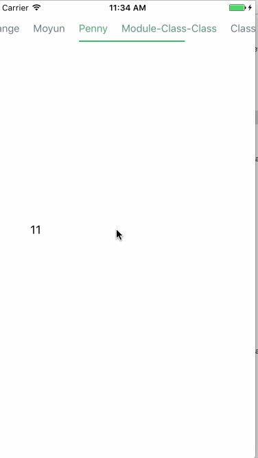
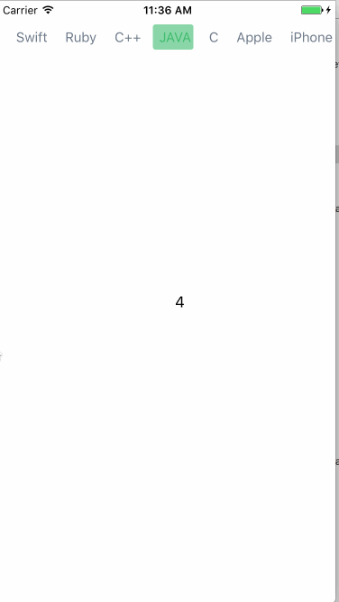

# CMTabbarView




[](https://travis-ci.org/momo605654602@gmail.com/CMTabbarView)
[](http://cocoapods.org/pods/CMTabbarView)
[](http://cocoapods.org/pods/CMTabbarView)
[](http://cocoapods.org/pods/CMTabbarView)

## Example

To run the example project, clone the repo, and run `pod install` from the Example directory first.

## Requirements

iOS 8.0+

## Installation

CMTabbarView is available through [CocoaPods](http://cocoapods.org). To install
it, simply add the following line to your Podfile:

```ruby
pod "CMTabbarView"
```

## Usage
You can create menu view

```
tabbarView = [[CMTabbarView alloc] initWithFrame:CGRectMake(0, 20, self.view.bounds.size.width, 40)];
tabbarView.delegate = self;
tabbarView.dataSource = self;
```

You need implement the protocol

```
- (NSArray<NSString *> *)tabbarTitlesForTabbarView:(CMTabbarView *)tabbarView;
```

## Author

Moyun, moyunmo@hotmail.com

## License

CMTabbarView is available under the MIT license. See the LICENSE file for more info.
